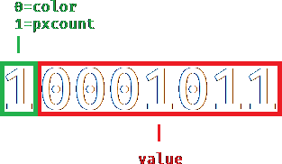

# DerLungRLE Encoding Specifications

**The format supports 7 bits of color data per pixel. It is a lossless run-length encoding but doesn't enlarge images that have lots of pixel variation.**

## Header

The first 2 Bytes of the file define the image width in pixels.

### Examples:

image is 235px wide: `00000000 11101011`

image is 13px wide: `00000000 00001101`

image is 5389px wide: `00010101 00001101`

## Body

The pixel data starts after the header and consists of pxcount bytes and color bytes. The pxcolor bytes define how often the color defined by the color byte should be repeated. The 7 bits of color data contained in the color bytes are mapped to the luminance value of the HSL spectrum while the saturation is 0 (grayscale).

The pxcount byte comes first, then the color byte that should be repeated as defined in the pxcount.

Color bytes without prefixed pxcount byte are also allowed and will be repeated once.

### Examples:

5 white pixels: `10000101 01111111`

23 black pixels: `10010111 00000000`

1 white pixel: `01111111`